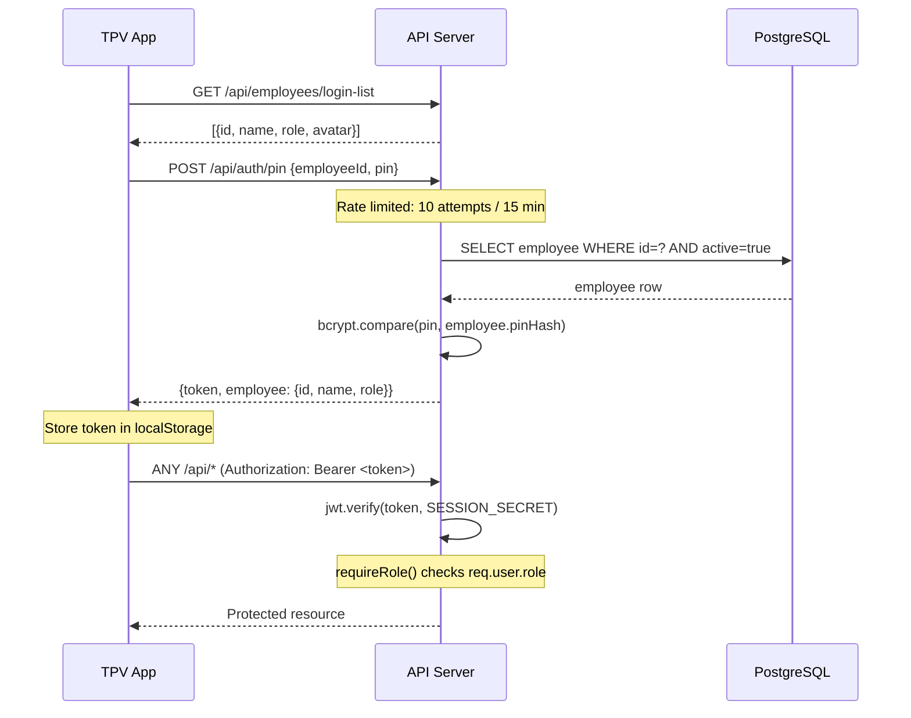
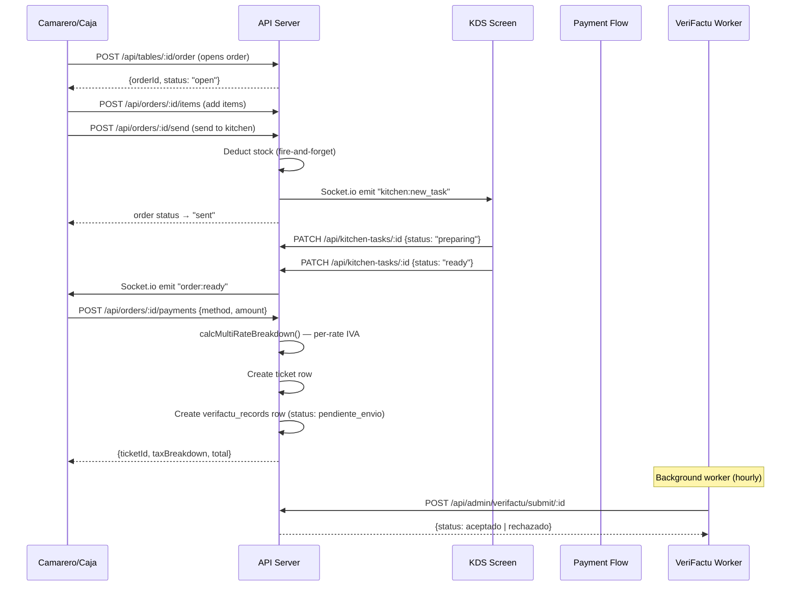

# Piccolo TPV — Architecture

> Last updated: 2026-07-17  
> Tech stack: TypeScript · Node.js 24 · Express 5 · PostgreSQL · Drizzle ORM · React + Vite · Socket.io · Zod

The legacy Convex QR artifact has been removed. The official QR product is now
maintained in `nicodam67/piccolo-qr-menu`; no cross-repository integration exists
yet. Future communication will use versioned APIs.

---

## 1. Monorepo Structure

```
piccolo-tpv/
├── artifacts/
│   ├── api-server/          # Express REST + WebSocket API
│   ├── piccolo-tpv/         # React SPA (TPV frontend)
│   └── mockup-sandbox/      # Vite component sandbox (design tool)
├── lib/
│   ├── db/                  # Drizzle schema + migrations + client
│   ├── api-spec/            # OpenAPI 3.1 spec (openapi.yaml)
│   ├── api-client-react/    # Auto-generated React Query hooks
│   └── api-zod/             # Auto-generated Zod validators
├── docs/                    # Documentation
└── scripts/                 # CI + maintenance scripts
```

The workspace is managed by **pnpm workspaces** (`pnpm-workspace.yaml`).  
All packages are under the `@workspace/` namespace.

---

## 2. Artifacts

### `artifacts/api-server`
- **Runtime:** Node.js ESM bundle built by esbuild
- **Framework:** Express 5 + pino-http logging + Socket.io
- **Database:** PostgreSQL via Drizzle ORM (`@workspace/db`)
- **Auth:** JWT (HS256, 12-hour expiry) issued on PIN login
- **Port:** `$PORT` environment variable

Key route files:
| File | Domain |
|------|--------|
| `auth.ts` | PIN login, employee login list |
| `orders.ts` | Order lifecycle, items, send to kitchen |
| `payments.ts` | Cobro, ticket generation, IVA breakdown |
| `categories.ts` | Products & categories (public menu) |
| `kds.ts` | Kitchen display system |
| `cash.ts` | Cash sessions, Z/X reports |
| `verifactu.ts` | VeriFactu fiscal chain |
| `stock.ts` | Ingredient stock, movements, waste |
| `crm.ts` + `loyalty-extended.ts` | CRM, gift cards, loyalty |
| `online-orders-v2.ts` | Online orders (current) |
| `setup.ts` | Setup wizard |
| `backup.ts` | DB backups |
| `audit.ts` | System audit |

### `artifacts/piccolo-tpv`
- **Framework:** React 18 + Vite
- **Routing:** Wouter (hash-less SPA routing)
- **State:** TanStack Query (server state) + React local state
- **Realtime:** Socket.io-client
- **UI:** Tailwind CSS v4 + Lucide icons + Sonner toasts

### `artifacts/mockup-sandbox`
- **Purpose:** Component isolation sandbox for design exploration (Vite dev server)
- Not used in production

---

## 3. Library Packages

### `lib/db`
Drizzle ORM schema, migrations, and database client.

```
lib/db/src/
├── schema/          # One file per domain (orders.ts, payments.ts, ...)
├── migrations/      # SQL migration files (0001 → 0014)
├── client.ts        # pg.Pool + drizzle() client
└── index.ts         # Re-exports all tables
```

Migration workflow: edit schema → `pnpm drizzle-kit generate` → manual apply → `tsc --build lib/db`.

### `lib/api-spec`
Single source of truth: `openapi.yaml`.  
Run `pnpm --filter @workspace/api-spec run codegen` to regenerate client + validators.  
A `.codegen-stamp` SHA guards against spec drift in CI.

### `lib/api-client-react`
Auto-generated TanStack Query hooks from the OpenAPI spec.  
Import pattern: `import { useGetOrders, customFetch } from '@workspace/api-client-react'`

### `lib/api-zod`
Auto-generated Zod schemas for request/response validation.

---

## 4. Auth Flow



**Token lifecycle:**
- Signed with `SESSION_SECRET` (env var, never in code)
- Expiry: 12 hours
- No refresh token flow — re-login on expiry
- Rate limiting: `express-rate-limit` on `/api/auth/pin` (10/15min per IP)

**Roles** (coarse-grained, enforced by `requireRole()` middleware):
`admin` · `manager` · `encargado` · `camarero` · `caja` · `cocina` · `repartidor`

---

## 5. Order Lifecycle



**Order statuses:** `open` → `sent` → `paid` → `cancelled`

---

## 6. Stock Deduction Trigger

When `POST /api/orders/:orderId/send` is called:

1. Fetch all items in the order (productId + quantity)
2. Fetch recipes linked to each product (product_recipes → ingredients)
3. For each ingredient used: `UPDATE ingredients SET current_stock -= consumed WHERE id = ?`
4. Insert stock_movements row (`movement_type: 'consumption'`, source: order)
5. **If deduction fails** → log to audit, continue (fire-and-forget — order is not blocked)

This is a known limitation (see `docs/errores-conocidos.md`, stock_deduction warning).

---

## 7. VeriFactu Chain

VeriFactu implements Spain's mandatory fiscal chain (Reg. 1007/2023).

```
verifactu_config      — one row: NIF, entorno, certificado, flags
verifactu_records     — one row per ticket: hash, hash anterior, entornoEnvio
```

**Chain guarantee:** Each record stores `hashAnterior` = SHA-256 of the previous record's full content.  
`GET /api/admin/verifactu/chain/verify` recomputes the entire chain and detects any break.

**Environments:**
| Value | Meaning |
|-------|---------|
| `simulador` | Local simulation, nothing sent to AEAT |
| `pruebas` | AEAT test environment (requires PFX certificate) |
| `produccion` | Live AEAT (requires confirmation dialog + audit log) |

Background worker runs hourly, submits `pendiente_envio` records (currently stub; mTLS cert needed for `pruebas`/`produccion`).

---

## 8. Print Routing

```
POST /api/print/:orderId/ticket    → prints customer receipt
POST /api/print/:orderId/comanda   → prints kitchen ticket
POST /api/print/:orderId/factura   → prints invoice
```

Routing logic (`artifacts/api-server/src/routes/print-routing.ts`):
1. Load `printers` table — each printer has `type` (receipt | kitchen | label) and `prepZone`
2. For comanda: match product's `prepZone` to printer's `prepZone`
3. Fallback to first active kitchen printer
4. Send ESC/POS commands via TCP (IP:Port) or local USB path

Kitchen zones: `cocina` · `barra` · `pastelería`

---

## 9. Socket.io Event Catalogue

All events use the `io` instance mounted at `/api` (same port as HTTP).

| Event | Direction | Payload | Purpose |
|-------|-----------|---------|---------|
| `kitchen:new_task` | server→client | `{taskId, zone, items[]}` | New comanda arrived at KDS |
| `kitchen:task_updated` | server→client | `{taskId, status}` | KDS status change |
| `order:ready` | server→client | `{orderId, tableId}` | All items ready |
| `table:status_changed` | server→client | `{tableId, status}` | Mesa state update |
| `notification:new` | server→client | `{id, type, message}` | System alert |
| `cash:session_closed` | server→client | `{sessionId, summary}` | Z-report available |
| `online_order:new` | server→client | `{orderId, orderNumber}` | Incoming online order |
| `online_order:status` | server→client | `{orderId, status}` | Online order state change |
| `verifactu:submitted` | server→client | `{recordId, result}` | Fiscal record sent to AEAT |

---

## 10. Key Design Decisions

| Decision | Rationale |
|----------|-----------|
| JWT-only auth (no sessions) | Stateless, works across tabs/devices; tradeoff: no server-side logout |
| PIN-based login | Designed for shared POS devices where staff rotate quickly |
| Drizzle ORM (no magic) | Explicit SQL, easy migrations, TypeScript-first |
| Fire-and-forget stock deduction | Orders must never be blocked by stock failure; failures logged for correction |
| VeriFactu local chain (no AEAT in dev) | Safe to develop without real fiscal submission |
| `isDemo` flag on operational tables | Simulation data can be purged without touching real records |
